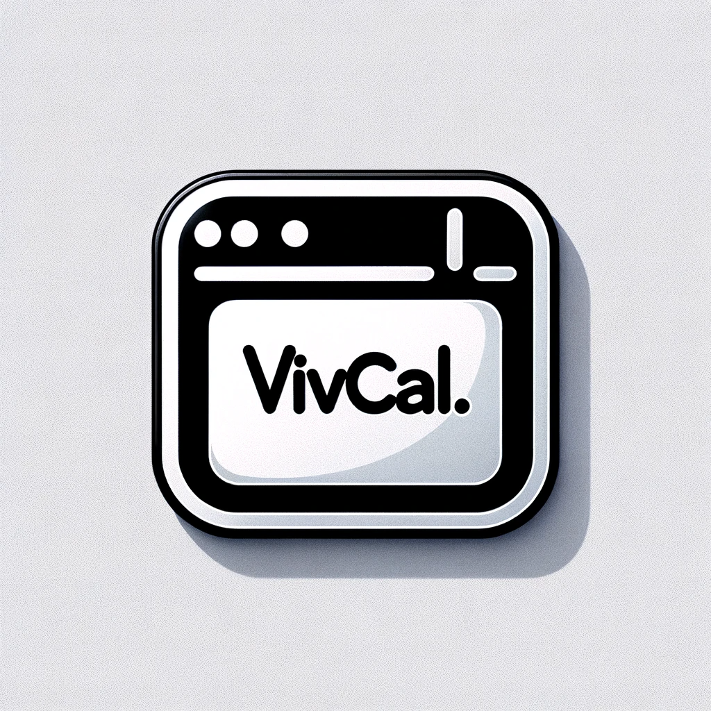

## Quick Start

```bash
git clone https://github.com/Portkey-AI/vivcal.git
cd vivcal
npm install
npm run setup   # Interactive setup wizard
npm start
```

The setup wizard will guide you through configuring Google Calendar credentials and optional Portkey API key.

## Manual Setup

### 1. Install Dependencies

```bash
npm install
```

### 2. Google Calendar Credentials (Required)

1. Go to [Google Cloud Console](https://console.cloud.google.com/)
2. Create a new project (or select existing)
3. Enable the **Google Calendar API** and **People API**
4. Go to **APIs & Services** → **Credentials**
5. Click **Create Credentials** → **OAuth client ID**
6. Select **Desktop app** as application type
7. Download the JSON and save as `google-creds.json` in the project root

The file should look like:
```json
{
  "installed": {
    "client_id": "...",
    "project_id": "...",
    "auth_uri": "https://accounts.google.com/o/oauth2/auth",
    "token_uri": "https://oauth2.googleapis.com/token",
    "auth_provider_x509_cert_url": "https://www.googleapis.com/oauth2/v1/certs",
    "client_secret": "...",
    "redirect_uris": ["http://localhost:7175/auth/google/callback"]
  }
}
```

### 3. Portkey API Key (Optional)

For AI-powered natural language event creation, create a `.env` file:

```bash
PORTKEY_API_KEY=your_key_here
PORTKEY_PROMPT_ID=your_prompt_id  # Optional, defaults to pp-dateparse-d0b165
```

Without this, VivCal uses chrono-node for local date parsing (works great for simple inputs like "meeting tomorrow at 3pm").

### 4. Run VivCal

```bash
npm start
```

## Keyboard Shortcuts

| Shortcut | Action |
|----------|--------|
| `Alt+N` | Quick add event |
| `Alt+C` | Toggle calendar panel |

## Building for Distribution

```bash
npm run dist
```

The packaged app will be in `dist/mac-arm64/VivCal.app`.

## Logs

Application logs are stored at:
```
~/Library/Application Support/vivcal/logs/main.log
```